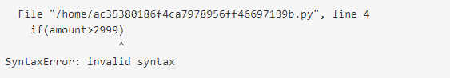

# Python


# Table of Contents
1. [Introduction To Python](#introduction-to-python)
2. [Basic Syntax And Structure ](#basic-syntax-and-structure)
3. [Object-Oriented Programming In Python](#object-oriented-programming-in-python)
4. [Python Collections](#python-collections)
5. [Python Libraries ](#python-libraries)
6. [Error Handling](error-handling)
7. [References](#references) 
   
#  Introduction to Python
### Overview and history of Python
Python is a high-level, interpreted programming language known for its simplicity, readability, and versatility. Created by Guido van Rossum and first released in 1991, Python has become one of the most popular programming languages globally.
### Installation and setup
Python usually comes pre-installed on most Linux distributions. However, if you need to install a specific version or set up Python for development, follow these steps:
#### 1. Check if Python is Installed
Open a terminal and type the following command to check if Python is installed:
```bash
python3 --version 
```
If Python is installed, you’ll see the version number. If it’s not installed, you can proceed with the installation.
#### 2. Update the Package List
Update your package list to ensure you have the latest versions of available packages:
```bash
sudo apt update
```

# 2. Basic Syntax and Structure
### Data types, variables, and constants
Python is a dynamically typed language, meaning that you don’t need to declare the type of a variable explicitly. The type is determined at runtime based on the value assigned to the variable. Here’s an overview of the basic data types, variables, and constants in Python.
### 1. Data Types in Python
Python supports various data types, which can be broadly categorized into the following:
#### a. Numeric Types
- int: Represents integers, e.g., 5, -10.

- float: Represents floating-point numbers, e.g., 3.14, -0.001.

- complex: Represents complex numbers, e.g., 3+4j, 2-3j.
#### b. Sequence Types
- str: Represents strings, which are sequences of characters, e.g., "Hello, World!".

- list: Represents ordered, mutable collections of items, e.g., [1, 2, 3], ["apple", "banana"].

- tuple: Represents ordered, immutable collections of items, e.g., (1, 2, 3), ("apple", "banana").
#### c. Mapping Type
dict: Represents unordered, mutable collections of key-value pairs, e.g., {"name": "John", "age": 30}.
#### d. Set Types
set: Represents unordered collections of unique items, e.g., {1, 2, 3}, {"apple", "banana"}.
#### e. Boolean Type
bool: Represents Boolean values True or False.
#### f. None Type
NoneType: Represents the absence of a value or a null value, e.g., None.
### 2. Variables in Python
A variable in Python is a name that is used to refer to memory location. A variable in Python is created the moment you first assign a value to it.
#### Declaring Variables
Variables are created by simply assigning a value to a name:
```
x = 10          # x is an integer
name = "Alice"  # name is a string
pi = 3.14       # pi is a float
```
#### Variable Naming Rules
- Variable names must start with a letter (a-z, A-Z) or an underscore (_).

- The name can only contain letters, digits (0-9), and underscores.

- Variable names are case-sensitive (name and Name are different).

- Variable names should not be Python reserved keywords (like for, while, class, etc.).
#### Reassigning Variables
Variables in Python can be reassigned to different values of the same or different data types:
```
x = 10       # x is initially an integer
x = "Hello"  # x is now a string
```
### 3. Constants in Python

- In Python, constants are typically defined by convention, meaning that the names of constants are usually written in all uppercase letters. Unlike variables, constants are not meant to be changed once they are assigned a value.

- By convention, constants are written in all caps, but Python doesn't enforce this. It's up to the programmer to maintain the immutability of these values.
```
PI = 3.14159
GRAVITY = 9.8
SPEED_OF_LIGHT = 299792458  # in meters per second
```
### Operators, control structures, and loops
### 1. Operator in Python
Operators are special symbols that perform operations on variables and values. Python supports the following types of operators:

#### a. Arithmetic Operators: 
Used to perform mathematical operations.
*  (Addition): a + b
*  (Subtraction): a - b
  
* (Multiplication): a * b
  
*  (Division): a / b

*  (Modulus): a % b

*  (Exponentiation): a ** b
#### b. Comparison Operators
Used to compare values and return a boolean result.
* (Equal to): a == b
* (Not equal to): a != b
* (Greater than): a > b
* (Less than): a < b
* (Greater than or equal to): a >= b
* (Less than or equal to): a <= b
#### c. Logical Operators 
Used to combine conditional statements.

* and: Returns True if both statements are true.
* or: Returns True if one of the statements is true.
* not: Reverses the boolean value.
#### d. Assignment Operators
Used to assign values to variables.
*  =(Assignment): a = 5
* += (Add and assign): a += 3
* -= (Subtract and assign): a -= 3
* *= (Multiply and assign): a *= 3
* /= (Divide and assign): a /= 3
* %= (Modulus and assign): a %= 3
### 2. Control Structures in Python
Control structures allow you to dictate the flow of execution within your program.
#### a. Conditional Statements
Execute certain blocks of code based on conditions.

* if Statement: Executes a block of code if a condition is true.
```
if condition:
     # code to execute
```
* else Statement: Executes a block of code if the if condition is false.
```
if condition:
    # code to execute
else:
    # code to execute
```
* elif Statement: Used for multiple conditions.
```
if condition1:
    # code to execute
elif condition2:
    # code to execute
else:
    # code to execute
```
* match Statement (Python 3.10+): Similar to switch-case in other languages.
```
match variable:
    case value1:
        # code to execute
    case value2:
        # code to execute
    case _:
        # default case
```
### 3. Loops in Python
Loops allow you to execute a block of code repeatedly.
* for Loop: Iterates over a sequence (such as a list, tuple, or string).
```
for variable in sequence:
    # code to execute
```
  Example: 
```
for i in range(5):
    print(i)
```
* while Loop: Repeats as long as a condition is true.
```
while condition:
    # code to execute
```
Example:
```
count = 0
while count < 5:
    print(count)
    count += 1
```
* break Statement: Exits the loop prematurely.
```
for i in range(10):
    if i == 5:
        break
    print(i)
```
* continue Statement: Skips the current iteration and continues with the next one.
```
for i in range(5):
    if i == 3:
        continue
    print(i)
```
### 3. Functions and lambda expressions
### 1. Functions in Python
Functions are reusable blocks of code that perform a specific task. They allow for modular and organized code by encapsulating functionality that can be called multiple times.
### Defining a Function
Functions are defined using the def keyword, followed by the function name and parentheses. Any parameters the function takes are listed within the parentheses.
### Syntax:
```
def function_name(parameters):
    """docstring (optional): Describe what the function does."""
    # code block
    return result  # (optional) returns a value
```
### Example:
```
def greet(name):
    """This function greets the person passed as a parameter."""
    return f"Hello, {name}!"

# Calling the function
message = greet("Alice")
print(message)  # Output: Hello, Alice!
```
### 2. Lambda Expressions in Python
Lambda expressions, also known as anonymous functions, are small, unnamed functions defined using the lambda keyword. They are typically used for short, simple operations.
### Syntax:
```
lambda arguments: expression
```
Arguments: Input values to the lambda function.

Expression: A single expression evaluated and returned by the lambda function.
```
# A lambda function to add 10 to a number
add_ten = lambda x: x + 10

# Using the lambda function
result = add_ten(5)
print(result)  # Output: 15
```

# 3. Object-Oriented Programming in Python
### 1. Classes and objects
#### Class
A class is a blueprint for creating objects. It defines a set of attributes (variables) and methods (functions) that the objects created from the class will have.
#### Object
An object is an instance of a class. When a class is defined, no memory is allocated until an object of that class is created.
```
# Define a class named 'Car'
class Car:
    # Constructor method to initialize the object
    def __init__(self, make, model, year):
        self.make = make  # Attribute for car make
        self.model = model  # Attribute for car model
        self.year = year  # Attribute for car year
    
    # Method to display car details
    def display_info(self):
        print(f"Car Info: {self.year} {self.make} {self.model}")

    # Method to start the car
    def start_engine(self):
        print(f"{self.make} {self.model}'s engine started.")

# Create an object (instance) of the Car class
my_car = Car("Toyota", "Camry", 2021)

# Access attributes
print(my_car.make)  # Output: Toyota
print(my_car.model)  # Output: Camry

# Call methods
my_car.display_info()  # Output: Car Info: 2021 Toyota Camry
my_car.start_engine()  # Output: Toyota Camry's engine started.
```
### 2. Inheritance, polymorphism, and encapsulation
#### Inheritance
Inheritance allows a class to inherit attributes and methods from another class. This helps in reusing code and creating a relationship between classes.
#### Example:
```
# Base class (Parent class)
class Animal:
    def __init__(self, name):
        self.name = name
    
    def sound(self):
        return "Some sound"

# Derived class (Child class) inheriting from Animal
class Dog(Animal):
    def sound(self):
        return "Bark"

# Create an object of Dog
my_dog = Dog("Buddy")

# Access inherited attribute
print(my_dog.name)  # Output: Buddy

# Call overridden method
print(my_dog.sound())  # Output: Bark
```
#### Polymorphism
Polymorphism allows methods to do different things based on the object it is acting upon, even if they share the same name. This is often achieved through method overriding.
#### Example:
```
# Base class
class Bird:
    def sound(self):
        return "Tweet"

# Derived class
class Cat(Animal):
    def sound(self):
        return "Meow"

# Polymorphism in action
def make_sound(animal):
    print(animal.sound())

# Create objects
bird = Bird()
cat = Cat("Whiskers")

# Call the same method on different objects
make_sound(bird)  # Output: Tweet
make_sound(cat)   # Output: Meow
```
#### Encapsulation
Encapsulation is the practice of restricting access to certain attributes or methods of an object to protect the internal state of the object.
#### Example:
```
class BankAccount:
    def __init__(self, balance):
        self.__balance = balance  # Private attribute
    
    def deposit(self, amount):
        if amount > 0:
            self.__balance += amount
    
    def withdraw(self, amount):
        if 0 < amount <= self.__balance:
            self.__balance -= amount
    
    def get_balance(self):
        return self.__balance

# Create a BankAccount object
account = BankAccount(1000)

# Accessing balance directly (Not allowed, will raise an error)
# print(account.__balance)  # AttributeError

# Accessing balance via method
print(account.get_balance())  # Output: 1000

# Deposit money
account.deposit(500)
print(account.get_balance())  # Output: 1500

# Withdraw money
account.withdraw(300)
print(account.get_balance())  # Output: 1200
```

# 4. Python Collections
### 1. Lists, tuples, sets, and dictionaries
#### Lists
A list is an ordered collection of items that are mutable (i.e., you can change, add, or remove items). Lists are defined using square brackets [].
#### Example:
```# Create a list of fruits
fruits = ["apple", "banana", "cherry"]

# Access an item by index
print(fruits[0])  # Output: apple

# Modify an item
fruits[1] = "blueberry"
print(fruits)  # Output: ['apple', 'blueberry', 'cherry']

# Add an item
fruits.append("orange")
print(fruits)  # Output: ['apple', 'blueberry', 'cherry', 'orange']

# Remove an item
fruits.remove("cherry")
print(fruits)  # Output: ['apple', 'blueberry', 'orange']
```
#### Tuples
A tuple is an ordered collection of items that are immutable (i.e., you cannot change, add, or remove items). Tuples are defined using parentheses ().
#### Example:
```# Create a tuple of colors
colors = ("red", "green", "blue")

# Access an item by index
print(colors[1])  # Output: green

# Attempt to modify an item (will raise an error)
# colors[1] = "yellow"  # TypeError: 'tuple' object does not support item assignment

# Tuples can be unpacked
r, g, b = colors
print(r, g, b)  # Output: red green blue
```
#### Sets
A set is an unordered collection of unique items. Sets are mutable, but they do not allow duplicate items. Sets are defined using curly braces {} or the set() function.
#### Example:
```# Create a set of numbers
numbers = {1, 2, 3, 4, 5}

# Add an item
numbers.add(6)
print(numbers)  # Output: {1, 2, 3, 4, 5, 6}

# Remove an item
numbers.remove(3)
print(numbers)  # Output: {1, 2, 4, 5, 6}

# Set operations
evens = {2, 4, 6, 8}
union = numbers.union(evens)
print(union)  # Output: {1, 2, 4, 5, 6, 8}
```
#### Dictionaries
A dictionary is an unordered collection of key-value pairs. Each key is unique, and it is used to access the corresponding value. Dictionaries are mutable and are defined using curly braces {} with key-value pairs separated by a colon :.
#### Example:
```# Create a dictionary of a student's information
student = {"name": "John", "age": 21, "major": "Computer Science"}

# Access a value by key
print(student["name"])  # Output: John

# Modify a value
student["age"] = 22
print(student)  # Output: {'name': 'John', 'age': 22, 'major': 'Computer Science'}

# Add a new key-value pair
student["gpa"] = 3.8
print(student)  # Output: {'name': 'John', 'age': 22, 'major': 'Computer Science', 'gpa': 3.8}

# Remove a key-value pair
del student["major"]
print(student)  # Output: {'name': 'John', 'age': 22, 'gpa': 3.8}
```
### 2. List comprehensions and generator expressions
#### List comrehensions
List comprehensions provide a concise way to create lists in Python. They are an elegant alternative to using loops and append() for creating lists. The syntax is straightforward and often results in more readable and compact code.


# 5. Python Library
### Overview of standard library
Python’s standard library is very extensive, offering a wide range of facilities. The library contains built-in modules (written in C) that provide access to system functionality such as file I/O that would otherwise be inaccessible to Python programmers, as well as modules written in Python that provide standardized solutions for many problems that occur in everyday programming.

### Popular third-party libraries: NumPy.
The NumPy library offers a wide variety of functions that allow you to perform advanced mathematical calculations, create arrays, matrix, and much more. Here are some of the most relevant functions: 
#### Install NumPy on your computer.
```
1. pip install numpy 
```
#### Import NumPy into your working module
```
1. import numpy as np
```
The NumPy library offers a wide variety of functions that allow you to perform advanced mathematical calculations, create arrays, matrix, and much more. Here are some of the most relevant functions:

##### Function	Description

np.array()	Creates a NumPy array from a list or another iterable object.

np.zeros()	Creates an array of zeros with specific dimensions.

np.linspace()	Creates an array with a sequence of evenly spaced numbers in a specified range and a number of elements.

np.random.rand()	Creates an array with random values in the range [0, 1] with specified dimensions.
#### Start using the functionalities of NumPy in your code
```
array_numbers = np.arange(10)
print(array_numbers) # output: [0 1 2 3 4 5 6 7 8 9]
a = np.array([4, 16, 25])
b = np.sqrt(a) # Square root element-wise ([2. 4. 5.])
```

# 6. Error Handling
### Exception handling and best practices

Errors are problems in a program that causes the program to stop its execution. On the other hand, exceptions are raised when some internal events change the program’s normal flow. 
#### Example:
```
initialize the amount variable
amount = 10000

# check that You are eligible to
#  purchase Dsa Self Paced or not
if(amount>2999)
    print("You are eligible to purchase Dsa Self Paced")
```
Output: 
    

Python uses try, except, else, and finally blocks to handle exceptions. Here’s a detailed overview of how exception handling works in Python:
#### Example:
```
try:
    # Code that may raise an exception
    result = 10 / 0
except ZeroDivisionError:
    # Code to execute if an exception occurs
    print("You can't divide by zero!")
```
try block: Contains code that might raise an exception.

except block: Contains code that runs if an exception occurs in the try block. You can specify the type of exception to handle.
```
try:
    file = open("example.txt", "r")
    data = file.read()
except FileNotFoundError:
    print("File not found!")
finally:
    file.close()
    print("File closed.")
```
The finally block is executed no matter what, whether an exception is raised or not. It is often used for cleanup actions
### Debugging techniques
#### Debugging with print statement
Print statements are one of the most used and straightforward  debugging techniques in Python. Print statements can help you track the flow of your program and detect which sections are creating errors. 
#### Example:
```
def calculate_total_price(unit_price, quantity):

    total_price = unit_price * quantity

    print(f"Total price is: {total_price}") # add a print statement to debug

    return total_price


price = calculate_total_price(10, 5)

Output: Total price is: 50
```
# References
1. https://www.w3schools.com/python/
2. https://docs.python.org/3/library/index.html
3. https://4geeks.com/lesson/what-are-third-party-libraries#numpy
4. https://www.geeksforgeeks.org/errors-and-exceptions-in-python/#syntax-errors-in-python

  
